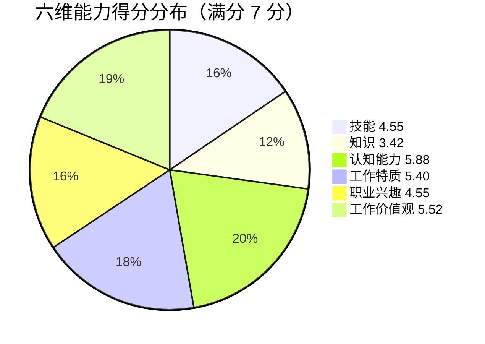
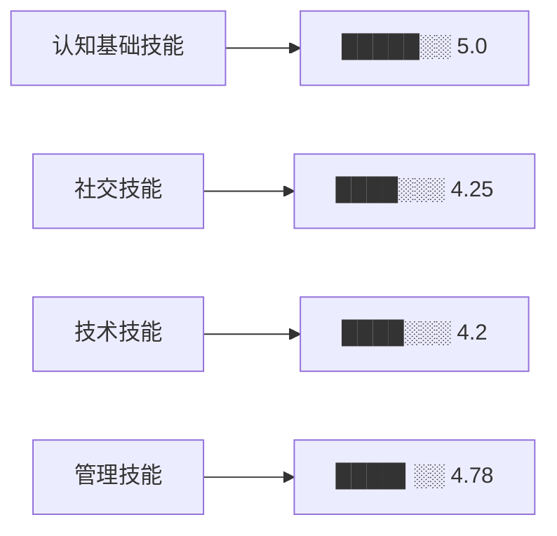
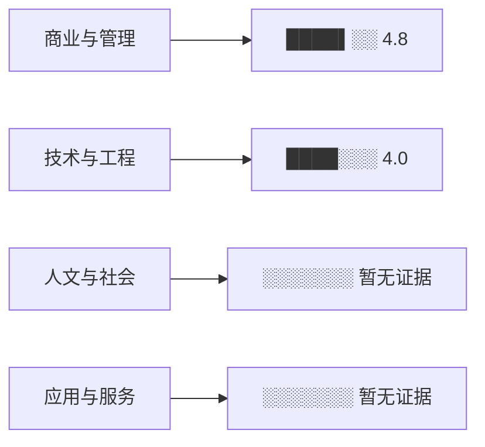
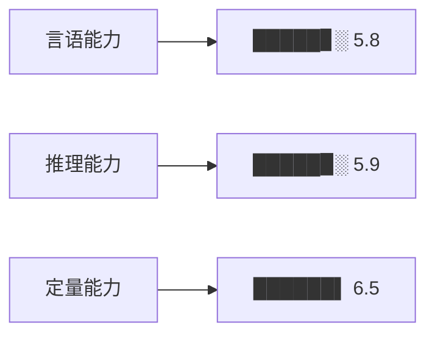
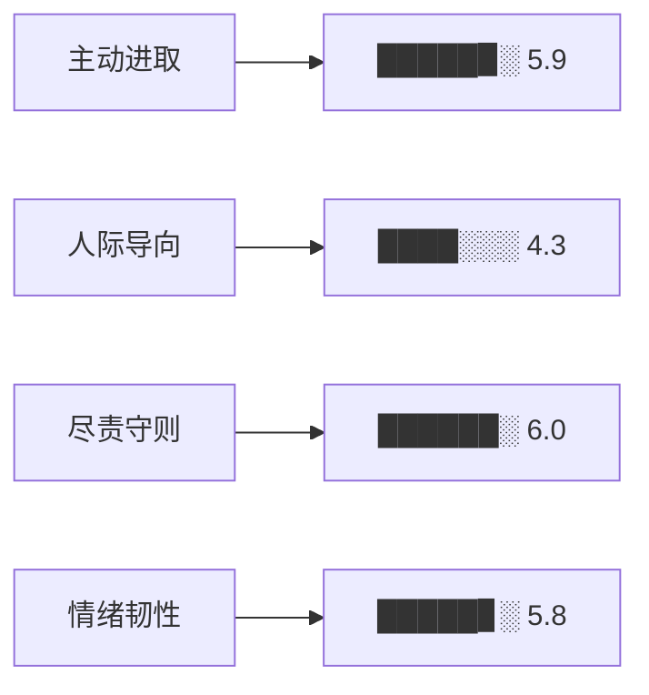
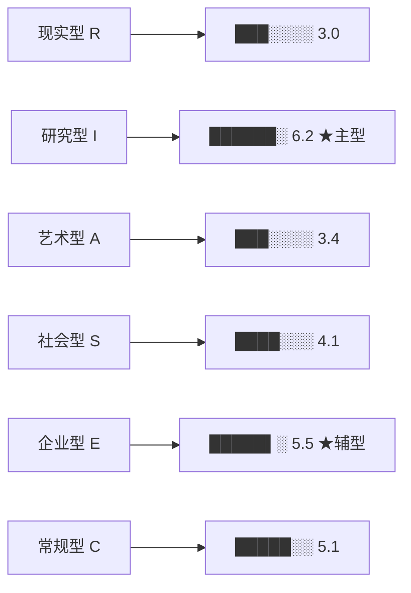
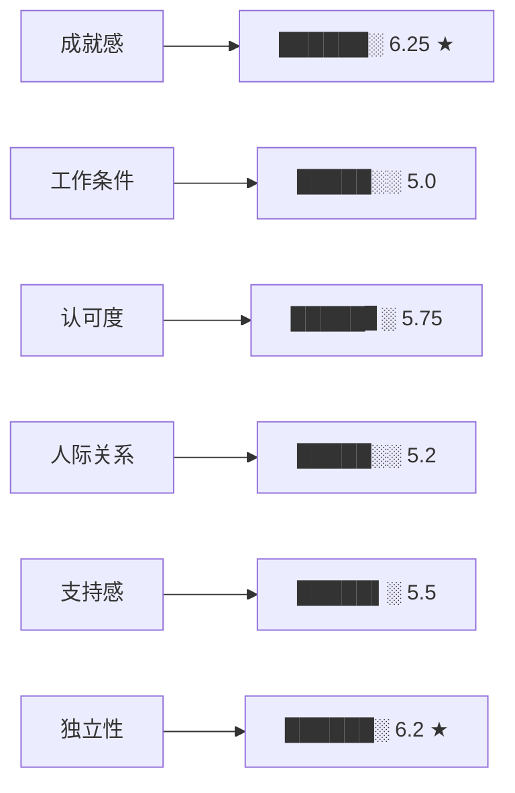
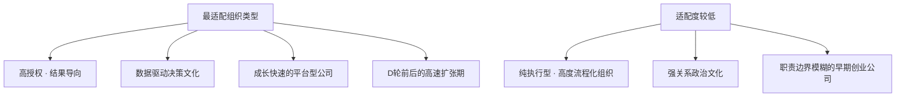

# 周启航 · 能力评估报告

> **评估编号**：98b4e695f7a4
> **评估日期**：2026-04-10
> **评估框架**：O\*NET 六维综合能力模型（技能 · 知识 · 认知能力 · 工作特质 · 职业兴趣 · 工作价值观）
> **数据来源**：简历 + 个人补充说明（无标准化测试数据）

---

## 一、总览

### 六维得分

### 维度得分总览

| 维度 | 得分 | 星级 | 置信度 | 数据质量 |
|------|------|------|--------|----------|
| 认知能力（Abilities） | **5.88** | ★★★★☆ | 中（简历推断） | 无认知测试，行为证据推断 |
| 工作价值观（Work Values） | **5.52** | ★★★★☆ | 中 | 个人陈述+行为信号 |
| 工作特质（Work Styles） | **5.40** | ★★★★☆ | 中 | 行为事件推断 |
| 职业兴趣（Interests） | **4.55** | ★★★☆☆ | 低（无RIASEC测试） | 简历关键词推断，无标准化数据 |
| 技能（Skills） | **4.55** | ★★★☆☆ | 高 | O\*NET锚点行为证据 |
| 知识（Knowledge） | **3.42** | ★★☆☆☆ | 中 | 2个维度有证据，2个维度数据不足 |

### 叙事摘要

周启航是一位**数据驱动型业务增长专家**，拥有计算机本科+应用统计硕士背景，7年横跨后端工程、数据分析、数据产品的复合经历。

核心优势集中在**认知能力**与**工作特质**两个维度：推理分析能力突出（5.9分），尽责守则与主动进取特质在同类候选人中处于高位（6.0/5.9）。价值观层面表现出强烈的成就导向与自主决策需求，与快速成长型组织高度适配。

主要提升空间在于**知识广度**（3.42）——人文社科与应用服务知识目前无证据支撑；社交技能中的**教导培训**（3.5）与**人际导向**特质（4.3）显示其在激励他人、建立关系方面仍有成长空间，这对从个人贡献者晋升为业务负责人的目标构成潜在制约。

---

## 二、六维能力画像

### 1. 技能（Skills）｜ 4.55 / 7

#### 子维度得分

#### 核心发现

**⬆ 优势项**

| 技能项 | 得分 | 关键证据 |
|--------|------|---------|
| 阅读理解 | 5.5 | 输出行业报告8篇，其中2篇用于品牌公关白皮书 |
| 科学方法 | 5.5 | 联合算法组建立商家健康评分与风险预警机制 |
| 批判性思维 | 5.5 | 推动北极星+二级指标树治理，发布口径字典216条 |
| 判断与决策 | 5.5 | 搭建分层补贴模型，区分三层用户 |

**⬇ 待提升项**

| 技能项 | 得分 | 说明 |
|--------|------|------|
| 教导培训 | 3.5 | 有间接推广案例，但无直接带教证据 |
| 技术设计 | 3.5 | 中台建设偏规范制定，非硬件/系统设计 |
| 系统监控 | 3.5 | 有数据稳定性治理，但属辅助角色 |

---

### 2. 知识（Knowledge）｜ 3.42 / 7

#### 子维度得分

#### 核心发现

**⬆ 优势项**

- **商业与管理（4.8）**：行政管理5.5，销售营销5.5，经济/商业4.0，人员管理4.5。有完整业务BP经验支撑。
- **技术与工程（4.0）**：数学与统计5.5，计算机科学4.5，工程设计4.0，工程技术2.0。技术背景扎实，统计建模能力尤为突出。

**⬇ 待解锁维度**

- **人文与社会**：简历中无哲学、社会学、心理学、政治学等相关证据，暂无法评分。
- **应用与服务**：无医疗、教育、法律、艺术服务等相关经历，暂无法评分。

---

### 3. 认知能力（Abilities）｜ 5.88 / 7

> ⚠️ **数据说明**：当前无标准化认知测试数据，以下得分基于简历行为证据推断，置信度为**中**。建议补充认知能力测试以提升可信度。

#### 子维度得分

#### 核心发现

| 子维度 | 得分 | 代表性证据 |
|--------|------|-----------|
| 言语能力 | 5.8 | 输出行业报告8篇；跨部门沟通议题设定与表达 |
| 推理能力 | 5.9 | 搭建分层补贴模型，3个月ROI 1.12→1.46；推动指标树治理 |
| 定量能力 | 6.5 | 应用统计硕士；xgboost建模；企业续费预测模型 |

定量能力是三项中最为突出的，与其学术背景（应用统计硕士）和工程经历（后端+数据双栈）高度契合。

---

### 4. 工作特质（Work Styles）｜ 5.40 / 7

#### 子维度得分

#### 核心发现

**⬆ 显著优势**

| 特质 | 得分 | 代表行为 |
|------|------|---------|
| 尽责守则（大五：责任心） | 6.0 | 谨慎6.0 / 细节6.5 / 可靠6.0 / 诚信5.5 |
| 主动进取（大五：外向+开放） | 5.9 | 成就导向6.5 / 主动性6.0 / 坚持6.0 / 领导6.0 |
| 情绪韧性（大五：情绪稳定） | 5.8 | 压力耐受6.0 / 自控5.5；主动建立压力管理机制 |

**⬇ 相对薄弱**

| 特质 | 得分 | 说明 |
|------|------|------|
| 人际导向（大五：宜人性） | 4.3 | 社交3.5 / 谦逊4.0 / 共情4.0；协作效率型而非关系建设型 |

人际导向的相对偏低与其职业风格（数据驱动、结果导向、直接沟通）高度一致，但晋升业务负责人后将更多需要影响力与关系资产。

---

### 5. 职业兴趣（Interests）｜ Holland 码：IE

> ⚠️ **数据说明**：当前无标准化RIASEC测试数据，以下分型基于简历关键词匹配推断，置信度为**低**。建议补充Holland职业兴趣测验获取精确分型。

#### RIASEC 分型

#### 兴趣分型解读

**主型 I（研究型）6.2**：热衷分析、建模、研究问题，对数据和知识有内在驱动力。证据：搭建分层补贴模型、构建商家健康评分系统、输出行业报告8篇。

**辅型 E（企业型）5.5**：有领导、管理、推动变革的欲望，适合承担业务责任。证据：管理跨职能9人团队，担任业务BP推动ROI改善。

**IE 组合画像**：分析型领导者——善于用数据和逻辑影响决策，而非单纯靠人际魅力。这与其自述"希望从项目负责人升级到业务经营负责人"的职业动机高度一致。

---

### 6. 工作价值观（Work Values）｜ 5.52 / 7

#### 子维度得分

#### 核心发现

**最强驱动力：成就感（6.25）+ 独立性（6.2）**

周启航的核心职业激励来自**结果驱动+自主决策**，而非外部认可或人际和谐。
> 典型信号："希望参与预算分配和经营决策，不只做分析支持"；"优先：成就感、成长速度、自主决策权"

**次强：认可度（5.75）+ 支持感（5.5）**

有晋升意愿和被认可的需求，同时希望管理者专业度高、公司公平透明。
对工作条件的要求体现为"可接受短期高强度，不可接受长期无序加班和职责边界不清"。

**文化匹配提示**

---

## 三、综合分析与行动处方

### TOP 3 优势

#### 1. 数据建模与量化决策能力
- 应统背景 + 后端工程 + 业务分析全栈，定量能力（6.5）在同类候选人中极为突出
- 典型成果：3个月拉新成本降18.7%，ROI 1.12→1.46，节省预算920万/季度
- **对用人单位价值**：能将模糊业务问题转化为可执行的数据方案，同时自己写代码验证——极为稀缺的复合型人才

#### 2. 高尽责 + 高韧性的执行特质
- 尽责守则（6.0）+ 情绪韧性（5.8）组合，意味着在高压、模糊、冲突环境中仍能持续交付
- 典型证据：遭遇预算评审质疑后坚持3个月用数据验证；双11高峰故障处理
- **对用人单位价值**：能接住复杂项目，不需要过多管理成本

#### 3. 成就导向 + 自主决策的价值观匹配
- 成就感（6.25）+ 独立性（6.2）表明其在授权充分的环境中将爆发更大能量
- 价值观与结果导向、数据驱动的高成长型组织天然契合
- **对用人单位价值**：无需过多激励设计，目标清晰即可自驱

---

### TOP 3 成长领域

#### 1. 知识广度（3.42）→ 补充商业思维纵深
- **问题**：人文社科与应用服务知识几乎空白，限制了作为业务负责人的视野边界
- **行动处方**：
  - 系统阅读1-2本战略管理/组织行为学经典（推荐《竞争战略》《人件》）
  - 参与公司级战略规划讨论，主动接触非数据领域的业务议题
  - 争取轮岗或兼任用户研究/市场策略项目，补充定性研究能力

#### 2. 人际导向（4.3）→ 从效率协作升级为关系领导
- **问题**：当前是"高效率、低温度"的协作风格，对晋升业务负责人后的团队建设构成挑战
- **行动处方**：
  - 建立1:1定期沟通节奏，不只谈任务，也关注团队成员的职业发展
  - 有意识地在非工作场合投入关系建设（团队复盘后的非正式交流等）
  - 对"授权不彻底"这一自述短板进行刻意练习——设定明确边界后真正放手

#### 3. 教导培训（3.5）→ 将个人方法论输出为组织知识
- **问题**：目前更多是个人执行者/制度制定者，系统带教证据不足
- **行动处方**：
  - 将增长补贴策略SOP v2.1转化为内部培训材料并主讲
  - 建立数据分析师/初级PM的带教机制，积累mentor经历
  - 以"如何教会别人做决策"为标准，反向审视自己的方法论是否足够结构化

---

## 四、评估方法说明

### 框架来源

| 维度 | 框架 | 来源 |
|------|------|------|
| 技能 | O\*NET Skills (2.A/2.B) | onetonline.org |
| 知识 | O\*NET Knowledge (2.C) | onetonline.org |
| 认知能力 | O\*NET Abilities (1.A) | onetonline.org |
| 工作特质 | O\*NET Work Styles (1.C) + Big Five | onetonline.org |
| 职业兴趣 | O\*NET Interests - Holland RIASEC (1.B.1) | Holland (1997) |
| 工作价值观 | O\*NET Work Values (1.B.2) - TWA | Dawis & Lofquist (1984) |

### 评分机制

- **量表**：均为 1–7 分制
- **技能/知识**：基于 O\*NET 行为锚点（Level 2/4/6 或 Level 1/4/7）插值，有具体行为证据时置信度为高
- **认知能力**：优先使用标准化测试数据（Mode A）；无测试数据时依赖行为推断（Mode B），置信度降为中
- **工作特质**：通过 Big Five 量表基础分转化，叠加简历行为修正 ±0.5，加权平均
- **职业兴趣**：有 RIASEC 测试时精确换算；无测试数据时通过关键词匹配推断，置信度为低
- **工作价值观**：全部基于语言信号推断（个人陈述 > 职位选择行为 > 简历描述），最高置信度为中

### 数据局限性声明

1. **本报告基于简历 + 个人补充说明生成，不包含任何标准化测试数据**
2. 认知能力和职业兴趣两个维度建议在面试环节补充相应测评，以提升置信度
3. 工作特质与工作价值观评分受候选人自我呈现偏差影响，建议结合结构化行为面试（BEI）进行验证
4. 所有推断结论应作为面试假设而非最终判定

---

*报告生成系统：Career Assessment Agent v1.0 · 评估框架：O\*NET Occupational Information Network*
